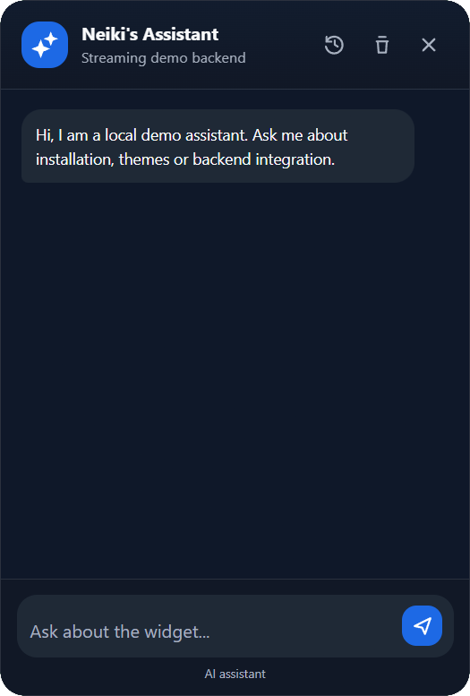

<p align="center">
  
</p>

<h1 align="center">Neiki's Assistant</h1>

<p align="center">
  
  
  
  
  <br>
  
  
</p>

<p align="center">
  <b>Lightweight Embeddable AI Chat Widget</b><br>
  <i>Vanilla JavaScript Web Component with streaming replies, markdown, theming, localization and conversation history.</i>
</p>

<p align="center">
  
  
  
  
</p>

---

<p align="center">
  
<p>
  
---

**Live version:** [https://neikiri.dev/assistant](https://neikiri.dev/assistant)

---

## Overview

Neiki's Assistant is an embeddable AI chat widget written in plain JavaScript with **zero dependencies**. Attach the custom element anywhere on a page and it becomes a fully working chat surface — floating launcher, streaming replies, markdown rendering, and conversation history — all rendered inside an isolated Shadow DOM so it never clashes with the host page's styles.

```html
<script src="https://cdn.neikiri.dev/neiki-assistant/neiki-assistant.min.js"></script>

<neiki-assistant api="/api/chat"></neiki-assistant>
```

That snippet is a complete, working chat widget. The minified build bundles its own CSS, so a single `<script>` tag and one custom element are enough to get started. From there you can configure branding, theme, localization, and wire up your own backend through the `api` attribute.

---

## Why Neiki's Assistant?

Most chat widgets either lock you into a specific AI provider or ship as a heavy, framework-dependent bundle. Neiki's Assistant avoids both.

- **One file, no dependencies.** The widget ships as a single script. The minified build embeds its CSS, so there is nothing else to install, import, or bundle. Drop it into a static page, a PHP template, or a SPA component — it behaves the same way.

- **Provider agnostic by design.** The widget never talks to an AI provider directly. It sends `{ messages, locale }` to the `api` endpoint you configure, and your backend decides whether that means OpenAI, OpenRouter, Ollama, Local AI, or any custom stack. Credentials never touch the browser.

- **Shadow DOM isolation guaranteed.** Host page CSS never leaks into the widget, and the widget's CSS never leaks into the host page. Ship it next to any design system without a specificity battle.

- **Zero-config by default, configurable when you need it.** `<neiki-assistant api="/api/chat"></neiki-assistant>` gives you a fully working chat window immediately. Every other attribute is optional.

- **Real conversation UX, not just a message list.** Streaming replies, markdown with syntax-highlighted code blocks and copy buttons, a typing indicator, and retry-on-error are all built in.

- **A real conversation history, not a single thread.** Past conversations can be browsed, switched between, deleted individually, or cleared all at once — backed by `localStorage`, no backend required for persistence.

- **Built-in safety.** All message content is escaped before markdown formatting, links are restricted to safe URL schemes, and the chat surface is fully isolated from the host page through Shadow DOM.

If you want a chat widget that talks to your own backend, ships from a single file, and drops into any page without CSS conflicts — that is the gap this project fills.

---

## Features

- **Vanilla JavaScript only** — no frameworks, packages, bundlers or build tools.
- **Web Components API** — works as a native custom element.
- **Shadow DOM** — isolated styling with no global CSS leakage.
- **Backend-ready** — messages are sent to a developer-configured `api` endpoint; no provider is assumed.
- **One-script CDN usage** — a single `<script>` tag is all you need; no build step required for consumers.
- **Streaming replies** — supports `text/event-stream`, `text/plain`, or plain JSON responses.
- **Markdown rendering** — fenced code blocks with syntax highlighting and copy buttons.
- **Conversation history** — browse, switch between, delete and clear past conversations.
- **Persistence** — conversations are saved to `localStorage` per session.
- **Typing indicator** — loading state, retry and error handling included.
- **Light, dark and auto themes** — with CSS variable customization.
- **English and Czech UI** — with an extensible i18n system.
- **Keyboard friendly** — Enter to send, Shift+Enter for newline, accessible controls.

---

## Getting started

The recommended install is the single bundled script from the CDN. CSS is included automatically.

```html
<script src="https://cdn.neikiri.dev/neiki-assistant/neiki-assistant.min.js"></script>
```

<details>
<summary><b>Other installation options</b> (pinned version, jsDelivr, npm, self-hosted)</summary>

<br>

**Pin a specific version**

```html
<script src="https://cdn.neikiri.dev/neiki-assistant/1.0.0/neiki-assistant.min.js"></script>
```

**Alternative CDN — jsDelivr**

```html
<script src="https://cdn.jsdelivr.net/gh/neikiri/neiki-assistant@latest/dist/neiki-assistant.min.js"></script>

<!-- Pinned -->
<script src="https://cdn.jsdelivr.net/gh/neikiri/neiki-assistant@1.0.0/dist/neiki-assistant.min.js"></script>
```

**Package manager**

```bash
npm install neiki-assistant
# or
yarn add neiki-assistant
# or
pnpm add neiki-assistant
```

**Self-hosted**

```html
<script src="path/to/neiki-assistant.min.js"></script>
```

</details>

---

## Quick Start

The minified CDN build embeds all widget CSS and registers the `<neiki-assistant>` custom element automatically.

```html
<!DOCTYPE html>
<html lang="en">
<head>
  <meta charset="UTF-8">
  <title>My Site</title>
</head>
<body>
  <!-- Place it anywhere; it renders as a fixed, floating widget -->
  <neiki-assistant
    api="/api/chat"
    title="Support"
    subtitle="Usually replies in a few seconds"
    language="en"
    theme="auto">
  </neiki-assistant>

  <script src="https://cdn.neikiri.dev/neiki-assistant/neiki-assistant.min.js"></script>
</body>
</html>
```

### Version-pinned CDN URL

When distributing over a CDN, pin to a specific version to avoid unexpected breaking changes:

```html
<script src="https://cdn.neikiri.dev/neiki-assistant/1.0.0/neiki-assistant.min.js"></script>
```

For local development, open `demo/index.html` through a local server because the source module loads CSS with `fetch()`.

---

## 🎨 Optional Custom Styling

The widget includes default styles automatically. You can customize it with CSS custom properties on the element:

```css
neiki-assistant {
  --neiki-accent: #10b981;
  --neiki-bg: #ffffff;
  --neiki-panel: #ffffff;
  --neiki-text: #111827;
  --neiki-user-bg: #10b981;
  --neiki-radius: 20px;
  --neiki-font: Inter, system-ui, sans-serif;
  --neiki-z-index: 2147483000;
}
```

---

## 🧩 Component API

### Attributes

| Attribute | Default | Description |
| --- | --- | --- |
| `api` | empty | Backend endpoint that receives chat requests. |
| `title` | localized | Header title. |
| `subtitle` | localized | Header subtitle. |
| `welcome` | localized | Initial assistant message. |
| `placeholder` | localized | Composer placeholder. |
| `language` | browser language | `en` or `cs`. Falls back to English. |
| `theme` | `auto` | `light`, `dark` or `auto`. |
| `accent` | `#2563eb` | Primary brand color. |
| `position` | `bottom-right` | `bottom-right` or `bottom-left`. |
| `storage-key` | current path | Key suffix for localStorage persistence. |
| `max-history` | `40` | Maximum stored messages per conversation. |
| `open` | absent | Opens the widget when present. |

### Methods

| Method | Description |
| --- | --- |
| `open()` | Opens the chat window. |
| `close()` | Closes the chat window. |
| `toggle()` | Toggles the chat window. |
| `clear()` | Starts a new conversation, archiving the current one to history if it has messages. |
| `sendMessage(text)` | Sends a message programmatically. |

### Events

| Event | Description |
| --- | --- |
| `neiki:message` | Fired after a reply is received. Includes `event.detail.messages`. |
| `neiki:clear` | Fired when a new conversation is started. |

```js
const assistant = document.querySelector('neiki-assistant');

assistant.open();
assistant.sendMessage('How do I install this widget?');

assistant.addEventListener('neiki:message', (event) => {
  console.log(event.detail.messages);
});

assistant.addEventListener('neiki:clear', () => {
  console.log('Started a new conversation');
});
```

---

## 🌐 Backend Integration

The browser sends a `POST` request to the configured `api` endpoint:

```json
{
  "messages": [
    { "role": "assistant", "content": "Hi, how can I help you today?" },
    { "role": "user", "content": "Hello" }
  ],
  "locale": "en"
}
```

Return JSON:

```json
{ "reply": "Hello from your backend." }
```

Or stream server-sent chunks:

```text
data: {"content":"Hello "}

data: {"content":"from streaming."}

data: [DONE]
```

The frontend does not know or store API keys. Your backend can use OpenAI, OpenRouter, Ollama, Local AI or any custom provider.

---

## 💡 Usage Examples

### Custom branding

```html
<neiki-assistant
  accent="#10b981"
  theme="dark"
  title="Ask Acme"
  subtitle="Product assistant">
</neiki-assistant>
```

### Czech localization

```html
<neiki-assistant
  api="/api/chat"
  language="cs"
  welcome="Dobrý den, jak vám dnes můžu pomoci?">
</neiki-assistant>
```

### Opened by default, custom storage key

```html
<neiki-assistant
  api="/api/chat"
  storage-key="support-widget"
  open>
</neiki-assistant>
```

---

## 🌍 Localization

Translations live in `src/i18n/`. To add another language to the CDN build, create one new translation file with the same keys as `en.js`. The build script automatically includes every `.js` locale file in that directory.

---

## 🛠️ Build

The repository keeps source files in `src/` and demo files in `demo/`. The existing `dist/` directory is generated manually.

Run:

```bash
python minify.py
```

The script writes:

- `dist/neiki-assistant.min.js`
- `dist/neiki-assistant.min.css`

The JavaScript bundle contains the CSS, so end users only need the JS file.

---

## ♿ Accessibility & UX

- **Keyboard accessible controls** with visible focus states.
- **ARIA roles and labels** on the dialog, log and icon buttons.
- **`aria-live` message log** announces new replies to assistive technology.
- **Reduced motion support** disables transitions and animations when requested.
- **Shadow DOM isolation** prevents style conflicts with host pages.

---

## 🔒 Security Notes

- Never put provider API keys in the widget.
- Assistant and user content is escaped before markdown formatting.
- Links are restricted to safe URL schemes.
- Shadow DOM reduces host-page CSS conflicts.

---

## 📄 License

This project is licensed under the **MIT License** — see the [LICENSE](LICENSE) file for details.

---

## 👨‍💻 Author

**neikiri**
GitHub: https://github.com/neikiri

---

## 📬 Contact

📧 Email: neikiri@neikiri.dev
